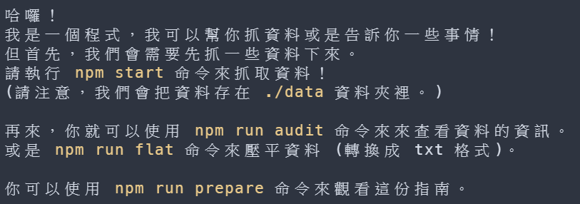

# iThelp Ironman Crawler

iT 邦幫忙鐵人賽爬蟲和一些沒什麼用的東西。

## 試試看

或

## 支援年分

- 2021
- 2020
- 2019
- 2018
- 2017

## 使用方式

### 0. Install Node.js

需要連結嗎？

Here you go: [https://nodejs.org/](https://nodejs.org/)

### 1. Clone This Repo

如果不會用 `git` 也可以用右上角下載成 `zip` 檔的方式下載。

### 2. Install Dependencies

到該資料夾下執行 `npm install` 或 `npm i`。

然後它應該會有提示。

## 截圖

## 其他

看起來鐵人賽網站每年都差不多...
